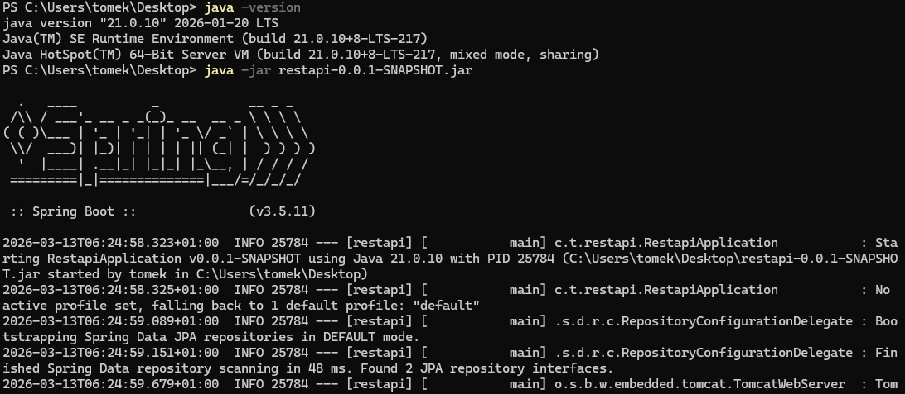
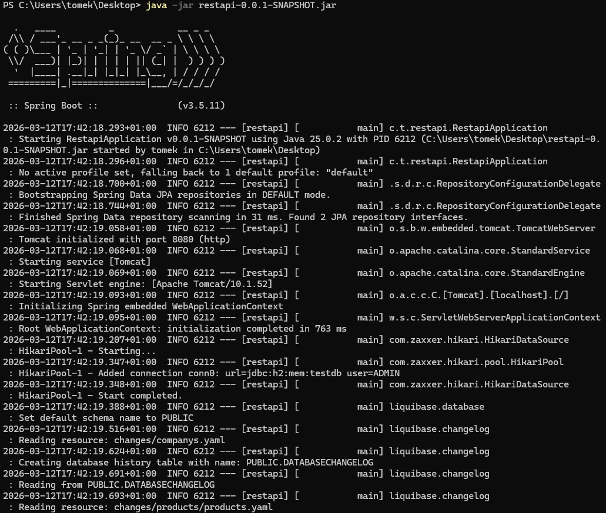
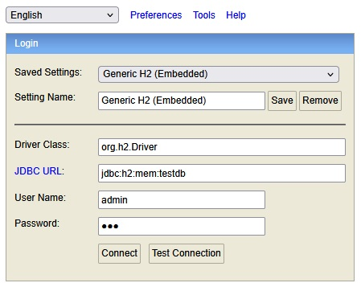
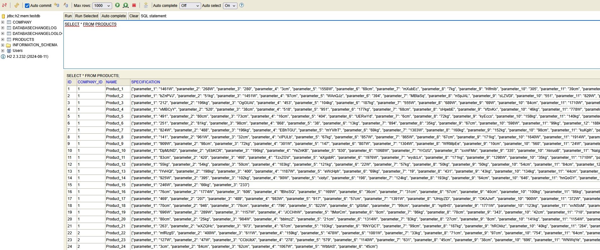
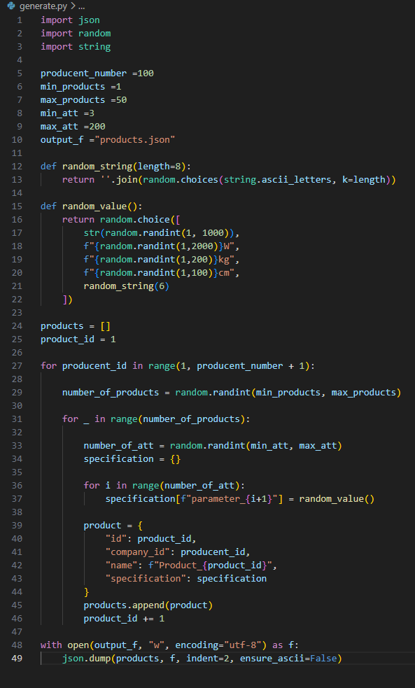
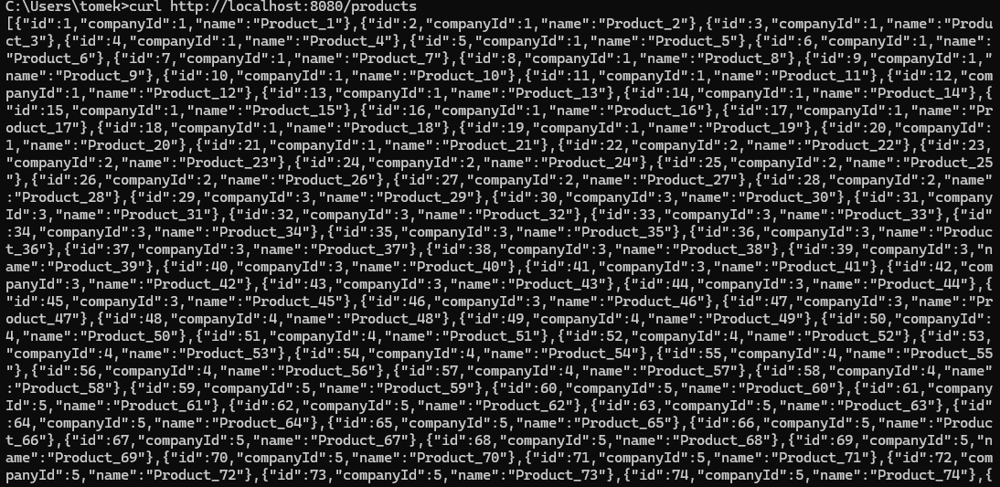
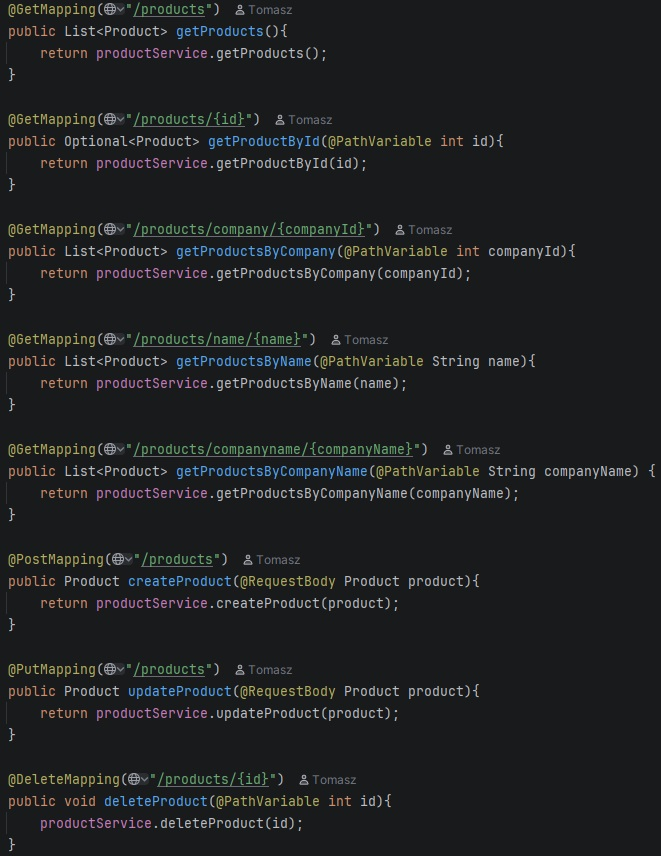
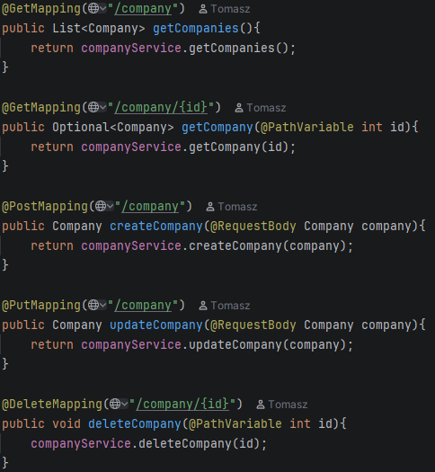

# 🔍 REST API

This project is a REST API created using Spring Boot 3.5.11 based on Maven. The Java version used is 25. The dependencies used are Liquidbase, H2 Database, Spring Web, and Spring Data JPA.

The software does not include a frontend interface.

Additionally, a Python script for generating product data has been included in the project. There is no need to run it, as the products data is already included in the project. Company data was generated using the online tool [Mockaroo](https://www.mockaroo.com/).

It is recommended to start the application using the "restapi-0.0.2-SNAPSHOT.jar" file.

Additionally/optionally software can be run in any IDE supporting java, IntelliJ IDEA is recommended. 

The database is created and configured when the application is launched and does not require user intervention.

API queries can be performed in any way, it is recommended to use the CMD console.

---

## 🛠️

 🛠️Support for Java 21🛠️

"restapi-0.0.2-SNAPSHOT.jar" file supports Java version 21. The files for the entire project supporting Java 21, on which version 0.0.2 was compiled, are located on the second branch.

To run the program using the restapi-0.0.2-SNAPSHOT file, you need to:

- Open a terminal in the folder where the file is located.
- Use the following command: java -jar restapi-0.0.2-SNAPSHOT.jar

  

At this point, the REST API should start working.

To run the program using the "restapi-0.0.1-SNAPSHOT.jar" file(Note: this version only supports Java version 25.), you need to:

- Open a terminal in the folder where the file is located.
- Use the following command: java -jar restapi-0.0.1-SNAPSHOT.jar

  

At this point, the REST API should start working.

For an additional option to open the file using the IDE, open and run the RestapiApplication.java. For Windows, you must allow the program to ignore Windows Defender.

The application runs on port 8080 by default; make sure that it is not occupied by another application. 
To log in to the H2 console, go to: [http://localhost:8080/h2-console](http://localhost:8080/h2-console).
Change the value in the "JDBC URL:" field to "jdbc:h2:mem:testdb."
Login: admin
Password: 123

For convenience, the last two photos show a list of supported queries and structure of them.

## 🛠️

---

## 🖼️

  
  
  
  
  
  

## 🖼️

---
